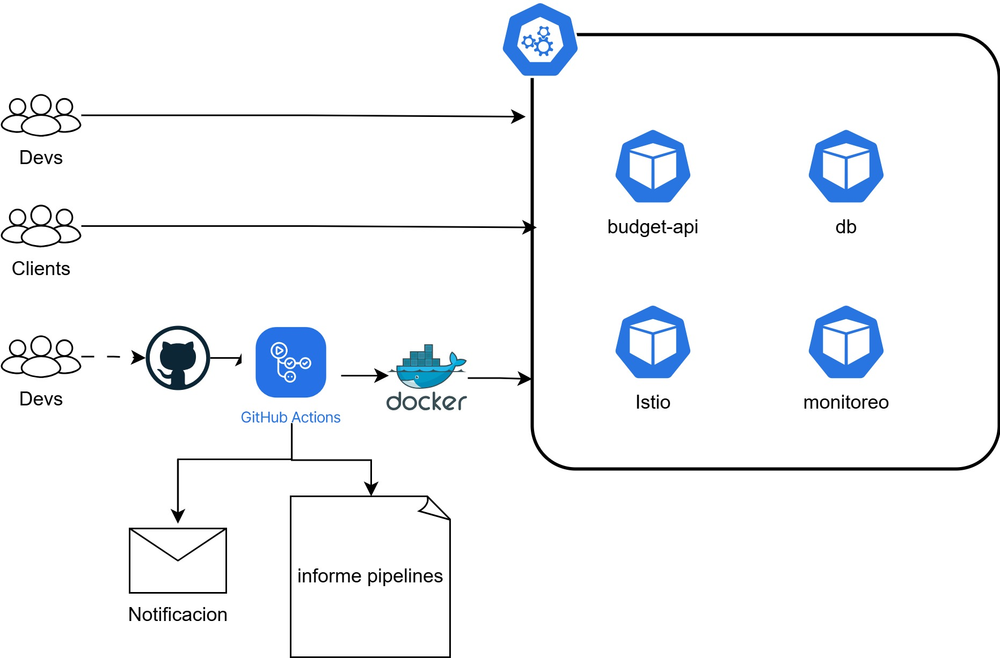

# 💰 Budget Tracker API

API desarrollada con **FastAPI** para gestionar ingresos y gastos personales. Incluye pruebas, cobertura, contenerización y análisis de seguridad automatizado.

---

## 📊 Diagrama de Arquitectura



---

## 🚀 Tecnologías utilizadas

- Python 3.11 + FastAPI
- SQLite + SQLAlchemy
- Pytest + Coverage
- Docker
- GitHub Actions
- Bandit (SAST), Trivy (SCA)
- Postman (colección incluida)

---

## ⚙️ Requisitos

- Python ≥ 3.9
- Docker (opcional)
- VSCode (recomendado)

---

## 🧪 Cómo ejecutar el proyecto

### ▶️ Localmente

1. Clonar el repositorio:

```bash
git clone https://github.com/tu_usuario/budget-tracker-api.git
cd budget-tracker-api

2. Crear entorno y dependencias:

bash
Copiar
Editar
python -m venv venv
.\\venv\\Scripts\\Activate.ps1  # En PowerShell
pip install -r requirements.txt
Crear la base de datos:

bash
Copiar
Editar
python
>>> from app.database import init_db
>>> init_db()
>>> exit()
Iniciar el servidor:

bash
Copiar
Editar
uvicorn app.main:app --reload
Visita: http://localhost:8000/docs

🐳 Con Docker
Construir la imagen:

powershell
Copiar
Editar
docker build -t budget-api .
Ejecutar el contenedor:

powershell
Copiar
Editar
docker run -p 8000:8000 budget-api
🧪 Pruebas Unitarias y Cobertura
powershell
Copiar
Editar
pytest
coverage run -m pytest
coverage report
coverage html
🔐 Seguridad
Este proyecto incluye análisis de seguridad automatizado en CI/CD:

Bandit (SAST)

Trivy (SCA)

Los reportes se publican como artefactos en GitHub Actions.

📬 Postman
Archivo: Presupuesto_API.postman_collection.json

Pasos:

Abrir Postman

Importar la colección

Probar endpoints

🧾 Estructura del proyecto
pgsql
Copiar
Editar
budget-api/
├── app/
│   ├── main.py
│   ├── models.py
│   ├── database.py
│   ├── startup.py
│   ├── routes/
│   └── schemas/
├── tests/
├── requirements.txt
├── Dockerfile
├── README.md
├── Diagrama.jpg
└── Presupuesto_API.postman_collection.json
👨‍💻 Autor
Desarrollado por Alejandro Olaya